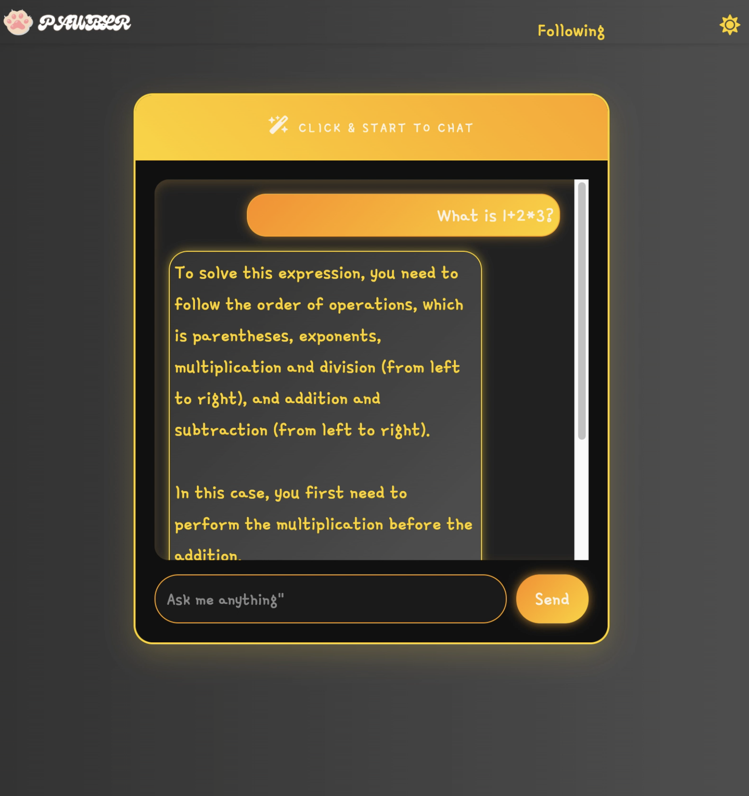
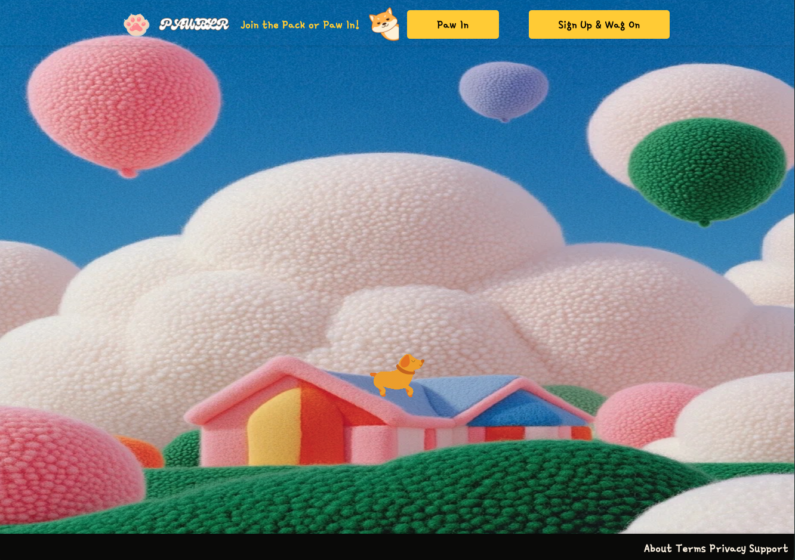
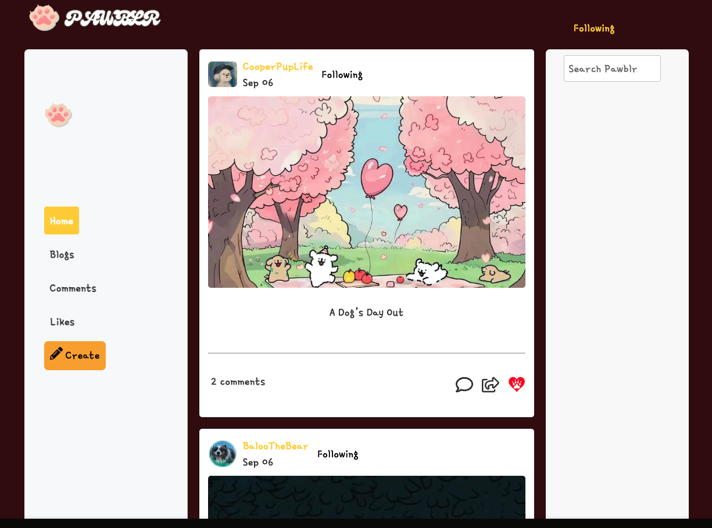
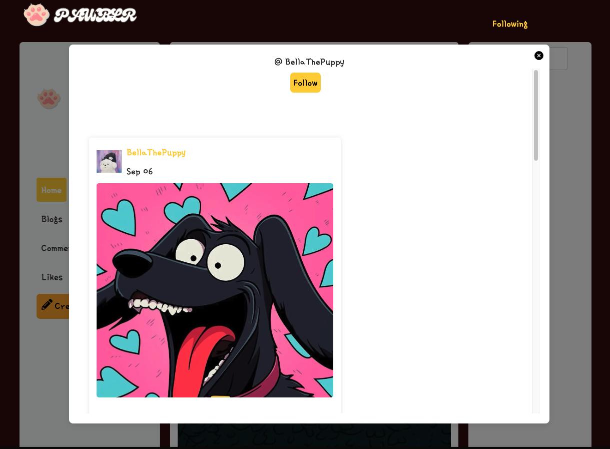
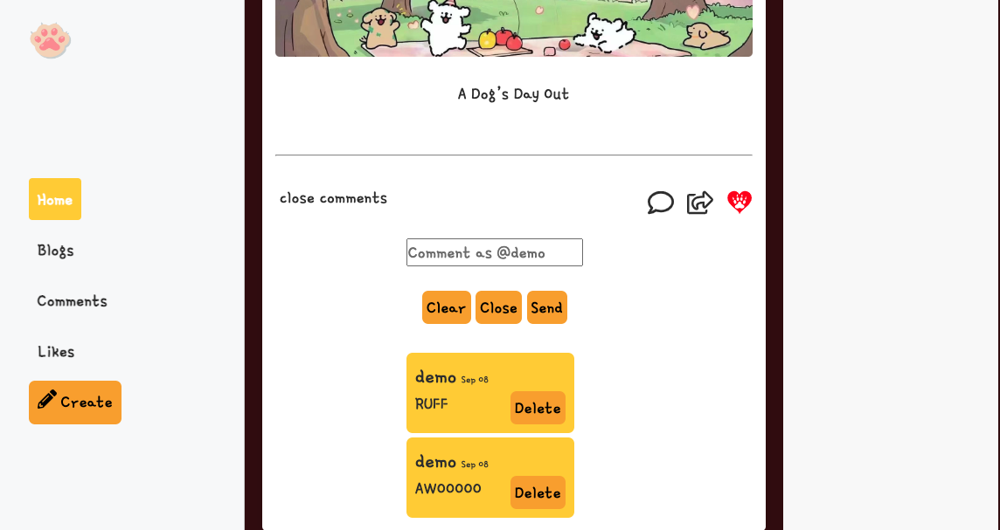
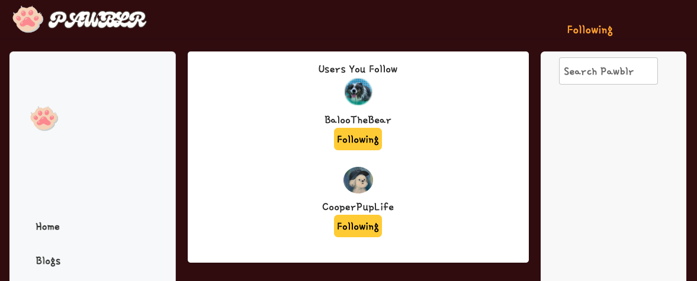

# Pawblr

Welcome to Pawblr, the ultimate social hub for dogs, their human companions, and AI! Whether you're a dog owner, enthusiast, or just can't resist adorable dog content, Pawblr is the place to share, discover, and celebrate all things canine. Create your own posts, follow other pups, explore trending tags, chat with AI about dog care, behavior tips, or fun facts, and connect with a community that loves dogs as much as you do. From funny moments to heartwarming stories, Pawblr is your go-to spot for everything dog-related. Share your dog's adventures, find new furry friends, and join the fun at Pawblr!


# Live Link
https://capstone-dumblr.onrender.com

## Tech Stack

Frameworks and Libraries


Database


Hosting


## Key Features

- **Backend with Flask and SQLAlchemy**: Built a robust backend with Flask and SQLAlchemy to ensure efficient data management, secure API endpoints, and seamless integration between the frontend and the database, providing a strong foundation for platform functionality.
- **Dynamic UI powered by React, Redux, and React Router**: Created a responsive, visually appealing user interface using React, Redux, and React Router. Applied modern UX/UI design principles to deliver a smooth and intuitive user experience, with efficient state management and effortless navigation across the platform.
- **Intuitive Functionality for Blog, Tag, Comment, Like and Follow**: Implemented comprehensive CRUD functionality for blog posts, tags, comments, likes, and follows, allowing users to manage their content and interactions seamlessly.
- **Keyword-Based Filtering**: Developed a dynamic search and filter feature that enables users to easily find relevant blogs and other users based on tags and usernames, enhancing content discovery across the platform.

## Index

[Feature List](https://github.com/Mengxuan-Liang/capstone-dumblr/wiki/MVP's-Feature-List)  | [Database Schema](https://github.com/Mengxuan-Liang/capstone-dumblr/wiki/Database-Schema-and-Backend-Routes) | [User Stories](https://github.com/Mengxuan-Liang/capstone-dumblr/wiki/User-Stories)  | [Wireframes](https://github.com/Mengxuan-Liang/capstone-dumblr/wiki/Wireframes)

# Live Site Preview

### Pawblr AI Assistant



### Pawblr Log in/ Sign up Page



### Pawblr Landing Page



### Pawblr User Profile Page



### Pawblr Expanded Comment Section



### Pawblr Following Page



# Endpoints

# API Documentation - Backend API Routes

## USER AUTHENTICATION/AUTHORIZATION

### All endpoints that require authentication

All endpoints that require a current user to be logged in.

- Request: endpoints that require authentication
- Error Response: Require authentication

  - Status Code: 401
  - Headers:
    - Content-Type: application/json
  - Body:

    ```json
    {
      "message": "Authentication required"
    }
    ```

### All endpoints that require proper authorization

All endpoints that require authentication and the current user does not have the
correct role(s) or permission(s).

- Request: endpoints that require proper authorization
- Error Response: Require proper authorization

  - Status Code: 403
  - Headers:
    - Content-Type: application/json
  - Body:

    ```json
    {
      "message": "Forbidden"
    }
    ```

### Get the Current User

Returns the information about the current user that is logged in.

- Require Authentication: false
- Request

  - Method: GET
  - URL: /api/session
  - Body: none

- Successful Response when there is a logged in user

  - Status Code: 200
  - Headers:
    - Content-Type: application/json
  - Body:

    ```json
    {
      "user": {
        "id": 1,
        "first_name": "John",
        "last_name": "Smith",
        "email": "john.smith@gmail.com",
        "username": "JohnSmith",
        "profile_image": "http://website.com/image.jpg"
      }
    }
    ```

- Successful Response when there is no logged in user

  - Status Code: 200
  - Headers:
    - Content-Type: application/json
  - Body:

    ```json
    {
      "user": null
    }
    ```

### Log In a User

Logs in a current user with valid credentials and returns the current user's
information.

- Require Authentication: false
- Request

  - Method: POST
  - URL: /api/session
  - Headers:
    - Content-Type: application/json
  - Body:

    ```json
    {
      "credential": "john.smith@gmail.com",
      "password": "secret password"
    }
    ```

- Successful Response

  - Status Code: 200
  - Headers:
    - Content-Type: application/json
  - Body:

    ```json
    {
      "user": {
        "id": 1,
        "first_name": "John",
        "last_name": "Smith",
        "email": "john.smith@gmail.com",
        "username": "JohnSmith",
        "profile_image": "http://website.com/image.jpg"
      }
    }
    ```

- Error Response: Invalid credentials

  - Status Code: 401
  - Headers:
    - Content-Type: application/json
  - Body:

    ```json
    {
      "message": "Invalid credentials"
    }
    ```

- Error response: Body validation errors

  - Status Code: 400
  - Headers:
    - Content-Type: application/json
  - Body:

    ```json
    {
      "message": "Bad Request",
      "errors": {
        "credential": "Email or username is required",
        "password": "Password is required"
      }
    }
    ```

### Sign Up a User

Creates a new user, logs them in as the current user, and returns the current
user's information.

- Require Authentication: false
- Request

  - Method: POST
  - URL: /api/users
  - Headers:
    - Content-Type: application/json
  - Body:

    ```json
    {
      "id": 1,
      "first_name": "John",
      "last_name": "Smith",
      "email": "john.smith@gmail.com",
      "username": "JohnSmith",
      "profile_image": "http://website.com/image.jpg"
    }
    ```

- Successful Response

  - Status Code: 200
  - Headers:
    - Content-Type: application/json
  - Body:

    ```json
    {
      "user": {
        "id": 1,
        "first_name": "John",
        "last_name": "Smith",
        "email": "john.smith@gmail.com",
        "username": "JohnSmith",
        "profile_image": "http://website.com/image.jpg"
      }
    }
    ```

- Error response: User already exists with the specified email

  - Status Code: 500
  - Headers:
    - Content-Type: application/json
  - Body:

    ```json
    {
      "message": "Username is already in use.",
      "errors": {
        "email": "Email address is already in use."
      }
    }
    ```

- Error response: User already exists with the specified username

  - Status Code: 500
  - Headers:
    - Content-Type: application/json
  - Body:

    ```json
    {
      "message": "Username is already in use.",
      "errors": {
        "username": "User with that username already exists"
      }
    }
    ```

- Error response: Body validation errors

  - Status Code: 400
  - Headers:
    - Content-Type: application/json
  - Body:

    ```json
    {
      "message": "Bad Request",
      "errors": {
        "email": "Invalid email",
        "username": "Username is required",
        "first_name": "First Name is required",
        "last_name": "Last Name is required",
        "profile_picture": "Must be a valid URL"
      }
    }
    ```

## Blog Routes

### Get all Blogs

Returns all the Blogs

- Require Authentication: true
- Request

  - Method: GET
  - URL: /api/posts/
  - Body: none

- Successful Response

  - Status Code: 200
  - Headers:
    - Content-Type: application/json
  - Body:

    ```json
    [
      {
        "id": 1,
        "comments": [
          {
            'created_at':'Sep 03',
            'id': 1,
            'parent_comment_id':null,
            'post': {
              'id':1,
              'text':'blog text',
              'username':'author name'
            },
            'post_id,
            'text':'comment text',
            'updated_at':'Sep 04'
          }
        ],
        "created_at": "Sep 03",
        "id":1,
        "img": "https://blogimage/img.jpg",
        "labels":[{
          'id':1,
          'name':'label name'
        }],
        "likes":[{
          'id':1,
          'post_id':2,
          'user_id':3
        }],
        "original_post": null,
        "root_post":null,
        "text":"blog text",
        "updated_at": "Sep 04",
        "user_id":1
      }
    ]
    ```
### Create an blog

Creates and returns a new blog.

- Require Authentication: true
- Request

  - Method: POST
  - URL: /api/posts/
  - Headers:
    - Content-Type: application/json
  - Body:

    ```json
    {
      "id": 1,
      "text": "blog text",
      "user_id": 4,
      "img": "https://blogimage/img.jpg",
      "tags":'tag name'
    }
    ```

- Successful Response

  - Status Code: 201
  - Headers:
    - Content-Type: application/json
  - Body:

    ```json
     {
      "id": 1,
      "text": "blog text",
      "user_id": 4,
      "img": "https://blogimage/img.jpg",
      "tags":'tag name'
    }
    ```

- Error Response: Body validation errors

  - Status Code: 400
  - Headers:
    - Content-Type: application/json
  - Body:

    ```json
    {
      "message": "Bad Request",
      "errors": {
        "text": "Text must be between 2 and 100 characters."
      }
    }
    ```

### Edit an blog

Updates and returns an existing blog.

- Require Authentication: true
- Require proper authorization: blog must belong to the current user
- Request

  - Method: PUT
  - URL: /api/posts/:post_id
  - Headers:
    - Content-Type: application/json
  - Body:

    ```json
    {
      "text": "Updated blog text",
      "user_id": 1,
      "img": "https://blogimage/img.jpg",
      "tags":"new tags"
    }
    ```

- Successful Response

  - Status Code: 200
  - Headers:
    - Content-Type: application/json
  - Body:

    ```json
    {
      "text": "Updated blog text",
      "user_id": 1,
      "img": "https://blogimage/img.jpg",
      "tags":"new tags"
    }
    ```

- Error Response: Body validation errors

  - Status Code: 400
  - Headers:
    - Content-Type: application/json
  - Body:

    ```json
    {
      "message": "Bad Request",
      "errors": {
        "text": "Text must be between 2 and 100 characters."
      }
    }
    ```

- Error response: Couldn't find an blog with the specified id

  - Status Code: 404
  - Headers:
    - Content-Type: application/json
  - Body:

    ```json
    {
      "message": "Post not found"
    }
    ```

### Delete an blog

Deletes an existing blog.

- Require Authentication: true
- Require proper authorization: blog must belong to the current user
- Request

  - Method: DELETE
  - URL: /api/blogs/:post_id
  - Body: none

- Successful Response

  - Status Code: 200
  - Headers:
    - Content-Type: application/json
  - Body:

    ```json
    {
      "message": "Post deleted"
    }
    ```

- Error response: Couldn't find an blog with the specified id

  - Status Code: 404
  - Headers:
    - Content-Type: application/json
  - Body:

    ```json
    {
      "message": "Post not found"
    }
    ```

## COMMENT

### Get all Reviews of the Current User

Returns all the reviews written by the current user.

- Require Authentication: true
- Request

  - Method: GET
  - URL: /api/comments/
  - Body: none

- Successful Response

  - Status Code: 200
  - Headers:
    - Content-Type: application/json
  - Body:

    ```json
    {
      "Reviews": [
       {
            "id": 1
            "text": "comment text",
            "post_id": 1,
            "user_id": 1,
            "parent_comment_id": 1,
            "user": (
                {
                    "id": 1,
                    "username": "baloo"
                }
            ),
            "post": (
                {
                    "id": 1,
                    'username': "baloo",
                    "text": "post text"
                }
            ),
            "created_at": "Sep 05",
            "updated_at": "Sep 06"
       }
      ]
    }
    ```
- Error response: Couldn't find any comment

  - Status Code: 404
  - Headers:
    - Content-Type: application/json
  - Body:

    ```json
    {
      "message": "Comment not found"
    }
    ```
### Get all Reviews by an blog's id

Returns all the reviews that belong to an blog specified by id.

- Require Authentication: true
- Request

  - Method: GET
  - URL: /api/comments/post_id
  - Body: none

- Successful Response

  - Status Code: 200
  - Headers:
    - Content-Type: application/json
  - Body:

  ```json
   {
      "Reviews": [
       {
            "id": 1
            "text": "comment text",
            "post_id": 1,
            "user_id": 1,
            "parent_comment_id": 1,
            "user": (
                {
                    "id": 1,
                    "username": "baloo"
                }
            ),
            "post": (
                {
                    "id": 1,
                    'username': "baloo",
                    "text": "post text"
                }
            ),
            "created_at": "Sep 05",
            "updated_at": "Sep 06"
       }
      ]
    }
  ```
- Error response: Couldn't find an blog with the specified id

  - Status Code: 404
  - Headers:
    - Content-Type: application/json
  - Body:

    ```json
    {
      "message": "Post not found"
    }
    ```
- Error response: Couldn't find comment with a blog

  - Status Code: 404
  - Headers:
    - Content-Type: application/json
  - Body:

    ```json
    {
      "message": "Comment not found"
    }
    ```

### Create a comment for an blog based on the blog's id

Create and return a new comment for an blog specified by id.

- Require Authentication: true
- Request

  - Method: POST
  - URL: /api/comments/post_id
  - Headers:
    - Content-Type: application/json
  - Body:

    ```json
    {
      "text": "New comment for the blog.",
      "post_id": 1,
      "user_id":1
    }
    ```
- Successful Response

  - Status Code: 201
  - Headers:
    - Content-Type: application/json
  - Body:

    ```json
    {
      "text": "New comment for the blog.",
      "post_id": 1,
      "user_id":1
    }
    ```
- Error Response: Body validation errors

  - Status Code: 400
  - Headers:
    - Content-Type: application/json
  - Body:

    ```json
    {
      "message": "Bad Request",
      "errors": {
        "text": "Comment must be between 2 and 255 charactors."
      }
    }
    ```
- Error response: Couldn't find an blog with the specified id

  - Status Code: 404
  - Headers:
    - Content-Type: application/json
  - Body:

    ```json
    {
      "message": "Post not found"
    }
    ```
- Error response: Couldn't find comment with a blog

  - Status Code: 404
  - Headers:
    - Content-Type: application/json
  - Body:

    ```json
    {
      "message": "Comment not found"
    }
    ```

### Edit a comment

Update and return an existing comment.

- Require Authentication: true
- Require proper authorization: Comment must belong to the current user
- Request

  - Method: PUT
  - URL: /api/comments/comment_id
  - Headers:
    - Content-Type: application/json
  - Body:

    ```json
    {
      "text": "new comment",
      "post_id": 3
    }
    ```

- Successful Response

  - Status Code: 200
  - Headers:
    - Content-Type: application/json
  - Body:

    ```json
    {
      "text": "new comment",
      "post_id": 3
    }
    ```

- Error Response: Body validation errors

  - Status Code: 400
  - Headers:
    - Content-Type: application/json
  - Body:

    ```json
    {
      "message": "Bad Request",
      "errors": {
        "text": "Comment must be between 2 and 255 charactors."
      }
    }
    ```

- Error response: Couldn't find a comment with the specified id

  - Status Code: 404
  - Headers:
    - Content-Type: application/json
  - Body:

    ```json
    {
      "message": "Comment not found"
    }
    ```

### Delete a comment

Delete an existing comment.

- Require Authentication: true
- Require proper authorization: Comment must belong to the current user
- Request

  - Method: DELETE
  - URL: /api/comments/comment_id
  - Body: none

- Successful Response

  - Status Code: 200
  - Headers:
    - Content-Type: application/json
  - Body:

    ```json
    {
      "message": "Comment deleted"
    }
    ```

- Error response: Couldn't find a comment with the specified id

  - Status Code: 404
  - Headers:
    - Content-Type: application/json
  - Body:

    ```json
    {
      "message": "Comment not found"
    }
    ```

## Likes Routes

### Get all of the Current User's liked blogs

Return all the Blogs in the Current User's like list

- Require Authentication: true
- Request

  - Method: GET
  - URL: /api/likes
  - Body: none

- Successful Response

  - Status Code: 200
  - Headers:
    - Content-Type: application/json
  - Body:

    ```json
    {
      "likes": [
       {
            'post_id': 1,
            'text': "post text",
            'img': "post image",
            'user_id': 1,
            'created_at': "Sep 05",
            'comments': [
              {
              "id": 1
              "text": "comment text",
              "post_id": 1,
              "user_id": 1,
              "parent_comment_id": 1,
              "user": (
                  {
                      "id": 1,
                      "username": "baloo"
                  }
              ),
              "post": (
                  {
                      "id": 1,
                      'username': "baloo",
                      "text": "post text"
                  }
              ),
              "created_at": "Sep 05",
              "updated_at": "Sep 06"
              }
            ]
        }
      ]
    }
    ```

### Add Like

Add like for current user to a post.

- Require Authentication: true
- Require proper authorization: User must be logged in

  - Method: POST
  - URL: /api/likes/post_id
  - Headers:
    - Content-Type: application/json
  - Body: False

- Successful Response

  - Status Code: 200
  - Headers:
    - Content-Type: application/json
  - Body:

    ```json
    {
      "message": "Post liked"
    }
    ```

- Error response: Couldn't find an blog with the specified id

  - Status Code: 404
  - Headers:
    - Content-Type: application/json
  - Body:

    ```json
    {
      "message": "Post not found"
    }
    ```

- Error response: User can not like a post twice

  - Status Code: 403
  - Headers:
    - Content-Type: application/json
  - Body:

    ```json
    {
      "message": "User already liked this post"
    }
    ```

### Remove like

Remove like for current user on a post

- Require Authentication: true
- Require proper authorization: like must be made by the current user
- Request

  - Method: DELETE
  - URL: /api/likes/post_id
  - Body: none

- Successful Response

  - Status Code: 200
  - Headers:
    - Content-Type: application/json
  - Body:

    ```json
    {
      "message": "Post unliked"
    }
    ```

- Error response: User did not like the post

  - Status Code: 400
  - Headers:
    - Content-Type: application/json
  - Body:

    ```json
    {
      "message": "like not found"
    }
    ```
## Follows Routes

### Get all of the Current User's following users

Return all the users in the Current User's following list

- Require Authentication: true
- Request

  - Method: GET
  - URL: /api/follow/status
  - Body: none

- Successful Response

  - Status Code: 200
  - Headers:
    - Content-Type: application/json
  - Body:

    ```json
    {
      "follows": [
        {
          follwer_id:1,
          follwee_id:2
        }
      ]
    }
    ```
### Add Follow

Current user follow anthor user

- Require Authentication: true
- Require proper authorization: User must be logged in

  - Method: POST
  - URL: /api/follow
  - Headers:
    - Content-Type: application/json
  - Body: False

- Successful Response

  - Status Code: 200
  - Headers:
    - Content-Type: application/json
  - Body:

    ```json
    {
      "message": "Followed successfully"
    }
    ```

- Error response: Couldn't find a user

  - Status Code: 404
  - Headers:
    - Content-Type: application/json
  - Body:

    ```json
    {
      "message": "User not found"
    }
    ```

- Error response: User can not follow a user twice

  - Status Code: 403
  - Headers:
    - Content-Type: application/json
  - Body:

    ```json
    {
      "message": "Already following this user"
    }
    ```

### Remove follow

Remove following for current user on another user

- Require Authentication: true
- Require proper authorization: following must be made by the current user
- Request

  - Method: DELETE
  - URL: /api/follow
  - Body: none

- Successful Response

  - Status Code: 200
  - Headers:
    - Content-Type: application/json
  - Body:

    ```json
    {
      "message": "Unfollowed successfully"
    }
    ```

- Error response: Current user did not follow this user

  - Status Code: 400
  - Headers:
    - Content-Type: application/json
  - Body:

    ```json
    {
      "message": "Not following this user"
    }
    ```


## Label Routes

### Get all tags

Return all tags

- Require Authentication: true
- Request

  - Method: GET
  - URL: /api/labels/
  - Body: none

- Successful Response

  - Status Code: 200
  - Headers:
    - Content-Type: application/json
  - Body:

    ```json
    {
      'id': 1,
      'name': 'tag name'
    }
    ```

### Add tags to a post

Attach tags with post while creating a post

- Require Authentication: true
- Require proper authorization: User must be logged in

  - Method: POST
  - URL: /api/labels/post_id/attach
  - Headers:
    - Content-Type: application/json
  - Body: none

- Successful Response

  - Status Code: 200
  - Headers:
    - Content-Type: application/json
  - Body:

    ```json
    {
      "message": "Label successfully associated with the post"
    }
    ```

- Error response: Couldn't find a blog with the specified id

  - Status Code: 404
  - Headers:
    - Content-Type: application/json
  - Body:

    ```json
    {
      "message": "Post not found"
    }
    ```
- Error response: Couldn't find a tag

  - Status Code: 404
  - Headers:
    - Content-Type: application/json
  - Body:

    ```json
    {
      "message": "Label not found"
    }
    ```
- Error response: Already added tag to post

  - Status Code: 400
  - Headers:
    - Content-Type: application/json
  - Body:

    ```json
    {
      "message": "Label is already associated with this post"
    }
    ```

### Remove tag from a post

Delete tag(s) from a post

- Require Authentication: true
- Require proper authorization: Post must belong to the current user 
- Request

  - Method: DELETE
  - URL: /api/labels/post_id/remove
  - Body: none

- Successful Response

  - Status Code: 200
  - Headers:
    - Content-Type: application/json
  - Body:

    ```json
    {
      "message": "Label successfully removed from the post"
    }
    ```

- Error response: Couldn't find the tag on post

  - Status Code: 404
  - Headers:
    - Content-Type: application/json
  - Body:

    ```json
    {
      "message": "Associationg not found"
    }
    ```

# Feature List
1. Blog
2. Comment
3. Like
4. Follow
5. Search


#  Future Implementation Goals
1. Reblog
2. Message (websokets)